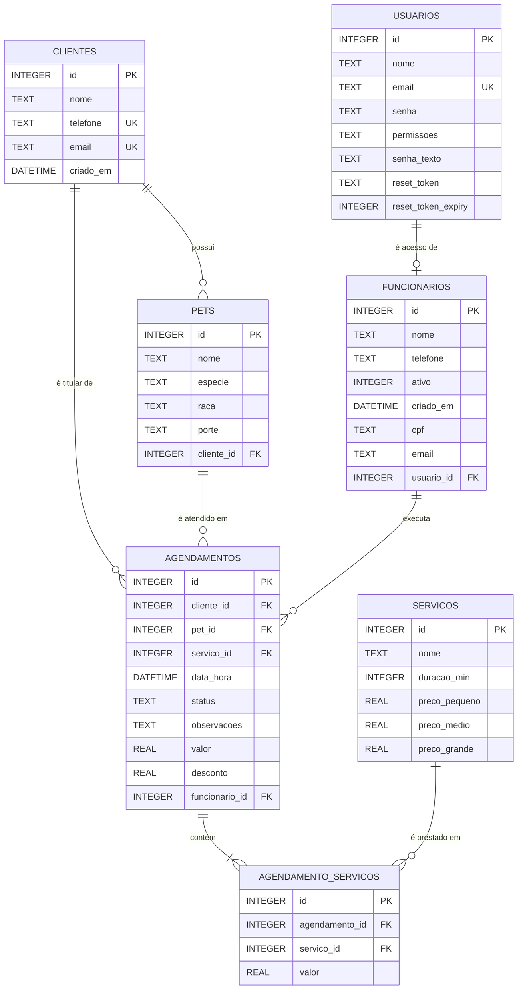

# DER — Modelo de Dados

Diagrama Entidade-Relacionamento do BiomaPetShop, extraído do schema real criado em
[database/init.js](../database/init.js). Banco: SQLite (arquivo `database/biomapet.sqlite`).

> As sessões de login ficam em um banco separado (`database/sessions.sqlite`), gerenciado
> pelo `connect-sqlite3`, e não fazem parte deste modelo.

---

## 1. Diagrama

---

## 2. Entidades

### 2.1. `usuarios`
Credenciais de acesso ao sistema. Todo login passa por esta tabela.

| Coluna | Tipo | Restrições | Observação |
|---|---|---|---|
| `id` | INTEGER | PK AUTOINCREMENT | |
| `nome` | TEXT | NOT NULL | |
| `email` | TEXT | NOT NULL, UNIQUE | Identificador de login |
| `senha` | TEXT | NOT NULL | Hash bcrypt (custo 10) |
| `permissoes` | TEXT | NOT NULL | `administrador` ou `funcionario` |
| `senha_texto` | TEXT | — | **Senha em texto puro.** Ver [DT-01](debitos-tecnicos.md#dt-01--senha-em-texto-puro-no-banco-senha_texto) |
| `reset_token` | TEXT | — | Token de redefinição (32 bytes hex) |
| `reset_token_expiry` | INTEGER | — | Epoch em ms; validade de 1 hora |

Registro semeado no primeiro boot: `admin@biomapet.com` / `123456`, perfil `administrador`.

### 2.2. `clientes`
Tutores dos pets.

| Coluna | Tipo | Restrições | Observação |
|---|---|---|---|
| `id` | INTEGER | PK AUTOINCREMENT | |
| `nome` | TEXT | NOT NULL | Normalizado por `capitalize()` |
| `telefone` | TEXT | índice único parcial | Único quando não nulo/vazio (RN01) |
| `email` | TEXT | índice único parcial | Único quando não nulo/vazio (RN01) |
| `criado_em` | DATETIME | DEFAULT CURRENT_TIMESTAMP | |

Os índices são **parciais** (`WHERE ... IS NOT NULL AND ... != ''`), então vários clientes
podem coexistir sem telefone ou sem e-mail.

### 2.3. `pets`
Animais vinculados a um cliente.

| Coluna | Tipo | Restrições | Observação |
|---|---|---|---|
| `id` | INTEGER | PK AUTOINCREMENT | |
| `nome` | TEXT | NOT NULL | |
| `especie` | TEXT | NOT NULL | |
| `raca` | TEXT | — | Obrigatório na validação da rota, não no schema |
| `porte` | TEXT | — | `Pequeno`, `Médio` ou `Grande` — define o preço |
| `cliente_id` | INTEGER | FK → `clientes(id)` | Sem `ON DELETE`; cascata feita em código |

O valor de `porte` é usado como chave de lookup em `calcularValores()`
([utils/helpers.js](../utils/helpers.js)) para escolher entre `preco_pequeno`,
`preco_medio` e `preco_grande`. Qualquer valor fora dessa lista cai silenciosamente
em `preco_medio`.

### 2.4. `funcionarios`
Dados operacionais do funcionário. O acesso ao sistema vem de `usuarios`; esta tabela
guarda o complemento (telefone, status ativo) e o vínculo.

| Coluna | Tipo | Restrições | Observação |
|---|---|---|---|
| `id` | INTEGER | PK AUTOINCREMENT | |
| `nome` | TEXT | NOT NULL | |
| `telefone` | TEXT | — | |
| `ativo` | INTEGER | DEFAULT 1 | `0` bloqueia o login |
| `criado_em` | DATETIME | DEFAULT CURRENT_TIMESTAMP | |
| `cpf` | TEXT | via ALTER | Nunca preenchido pelas rotas |
| `email` | TEXT | via ALTER | Duplicado de `usuarios.email` |
| `usuario_id` | INTEGER | via ALTER, sem FK declarada | Vínculo 1-1 com `usuarios` |

> ⚠️ As três últimas colunas são adicionadas por `ALTER TABLE` executado **antes** do
> `CREATE TABLE funcionarios` no mesmo arquivo. Em banco novo elas não existem.
> Ver [DT-02](debitos-tecnicos.md#dt-02--alter-table-antes-do-create-table-quebra-banco-novo).

### 2.5. `servicos`
Catálogo de serviços com tabela de preço por porte.

| Coluna | Tipo | Restrições | Observação |
|---|---|---|---|
| `id` | INTEGER | PK AUTOINCREMENT | |
| `nome` | TEXT | NOT NULL | Sem UNIQUE — a deduplicação do seed é feita em código |
| `duracao_min` | INTEGER | DEFAULT 60 | Registrado, mas **não usado** em nenhum cálculo |
| `preco_pequeno` | REAL | DEFAULT 0 | |
| `preco_medio` | REAL | DEFAULT 0 | |
| `preco_grande` | REAL | DEFAULT 0 | |

Seed automático: Banho, Tosa, Hidratação, Consulta Básica e Corte de Unhas.

### 2.6. `agendamentos`
Atendimento agendado. Entidade central do sistema.

| Coluna | Tipo | Restrições | Observação |
|---|---|---|---|
| `id` | INTEGER | PK AUTOINCREMENT | |
| `cliente_id` | INTEGER | FK → `clientes(id)` | Derivado do pet no momento da gravação |
| `pet_id` | INTEGER | FK → `pets(id)` | |
| `servico_id` | INTEGER | FK → `servicos(id)` | **Legado.** Substituído por `agendamento_servicos`; nunca é escrito |
| `data_hora` | DATETIME | NOT NULL | Texto no formato `YYYY-MM-DD HH:MM:SS` |
| `status` | TEXT | DEFAULT `'pendente'` | Valores usados: `confirmado`, `concluido`, `cancelado` |
| `observacoes` | TEXT | — | |
| `valor` | REAL | — | Total calculado no servidor |
| `desconto` | REAL | DEFAULT 0 | Sempre `0` na implementação atual |
| `funcionario_id` | INTEGER | via ALTER, **sem FK declarada** | Vai a NULL quando o funcionário é excluído |

O `DEFAULT 'pendente'` nunca é exercido: a rota de criação grava `'confirmado'`
explicitamente. Ver [DT-05](debitos-tecnicos.md#dt-05--vocabulário-de-status-divergente).

### 2.7. `agendamento_servicos`
Tabela associativa N:N entre agendamento e serviço, com o preço congelado no momento
do agendamento.

| Coluna | Tipo | Restrições | Observação |
|---|---|---|---|
| `id` | INTEGER | PK AUTOINCREMENT | |
| `agendamento_id` | INTEGER | NOT NULL, FK → `agendamentos(id)` ON DELETE CASCADE | |
| `servico_id` | INTEGER | NOT NULL, FK → `servicos(id)` | |
| `valor` | REAL | DEFAULT 0 | Preço do porte no momento do agendamento |

Guardar `valor` aqui é intencional: se o preço do serviço mudar depois, o histórico
do agendamento não é reescrito.

---

## 3. Relacionamentos

| # | Relação | Cardinalidade | Implementação |
|---|---|---|---|
| R1 | `usuarios` → `funcionarios` | 1 : 0..1 | `funcionarios.usuario_id` (sem FK declarada) |
| R2 | `clientes` → `pets` | 1 : N | `pets.cliente_id` |
| R3 | `clientes` → `agendamentos` | 1 : N | `agendamentos.cliente_id` |
| R4 | `pets` → `agendamentos` | 1 : N | `agendamentos.pet_id` |
| R5 | `funcionarios` → `agendamentos` | 1 : N (opcional) | `agendamentos.funcionario_id`, nulável |
| R6 | `agendamentos` ↔ `servicos` | N : N | via `agendamento_servicos` |

---

## 4. Integridade referencial

O `PRAGMA foreign_keys = ON` é aplicado na conexão ([database/db.js](../database/db.js)),
mas só uma FK tem regra de cascata declarada: `agendamento_servicos.agendamento_id`.

Todas as demais cascatas são feitas **manualmente, em transação, dentro das rotas**:

- **Excluir pet** ([routes/pets.routes.js](../routes/pets.routes.js)):
  `agendamento_servicos` → `agendamentos` → `pets`
- **Excluir cliente** ([routes/clientes.routes.js](../routes/clientes.routes.js)):
  `agendamento_servicos` → `agendamentos` → `pets` → `clientes`
- **Excluir funcionário** ([routes/funcionarios.routes.js](../routes/funcionarios.routes.js)):
  desvincula (`funcionario_id = NULL`) para preservar o histórico, depois remove
  `funcionarios` e `usuarios`

Consequência prática: qualquer `DELETE` feito fora dessas rotas (por exemplo, direto no
banco) deixa registros órfãos. Ver
[DT-06](debitos-tecnicos.md#dt-06--cascata-de-exclusão-vive-no-código-não-no-schema).

---

## 5. Regras de negócio que tocam o modelo

| Regra | Onde é aplicada |
|---|---|
| RN01 — unicidade de e-mail e telefone do cliente | Índices únicos parciais + checagem prévia na rota |
| RN02 — máximo de 3 agendamentos por horário | `COUNT` com `strftime('%Y-%m-%d %H', data_hora)` na rota de agendamentos |
| RN03 — mesmo pet sem serviços sobrepostos no mesmo horário | `JOIN` em `agendamento_servicos` na rota |
| RN04 — Tosa e Hidratação exigem Banho | `validarDependenciasServicos()` em [utils/helpers.js](../utils/helpers.js) |
| RN05 — excluir pet remove os agendamentos | Transação manual na rota de pets |
| RN06 — só admin exclui usuário e vê senha | `verificarAdmin` + `usuarios.senha_texto` |

Nenhuma dessas regras está expressa como constraint, trigger ou índice no banco: todas
dependem do código da rota. Um `INSERT` manual passa por cima de todas elas.
